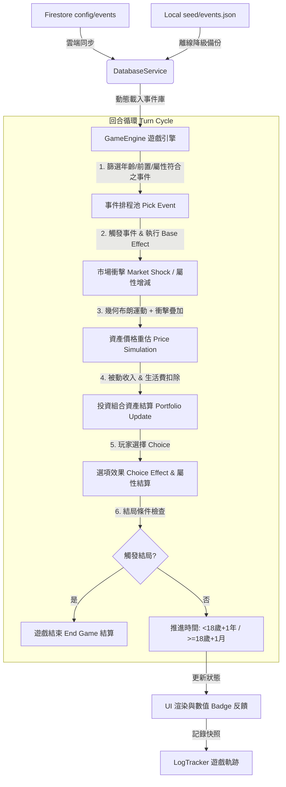

# InvestSim 事件編排與系統架構規範手冊 (skill.md)

本手冊為 **InvestSim（台灣投資人生模擬器）** 的核心架構與事件編排標準規範手冊。
本專案承襲 [Life-TW](https://github.com/kai890707/Life-TW) 的生命歷程模擬精神與台灣在地文化，並深度結合 **金融投資、資產配置、景氣循環與心理風控**，打造一套兼具生活真實感與投資深度的模擬體驗。

---

## 1. 系統架構與資料流程 (System Architecture & Data Flow)

### 1.1 目錄結構 (Directory Structure)

```text
InvestSim/
├── client/                        # 玩家前台（純靜態 HTML/CSS/JS，部署於 GitHub Pages）
│   ├── index.html                 # 遊戲主頁面與 HUD 介面
│   ├── css/
│   │   └── style.css              # Apple Design 視覺規範與響應式排版
│   ├── data/
│   │   └── events.json            # 全量事件資料庫標準備份檔（500+ 事件）
│   └── js/
│       ├── firebase-config.js     # Firebase 與 Firestore 連線設定
│       ├── db-service.js          # Firestore 雲端同步與備用種子資料庫
│       ├── auth.js                # Google 玩家帳號登入系統
│       ├── game-engine.js         # 核心模擬引擎（市場隨機漫步、事件分發、結局判定）
│       ├── log-tracker.js         # 歷程紀錄器（每月快照、交易紀錄、事件軌跡）
│       └── ui.js                  # 畫面渲染、事件卡片、折疊與數值反饋特效
├── admin/                         # 管理後台（React + Vite，提供視覺化 CRUD 與樹狀圖）
│   ├── src/
│   │   ├── pages/
│   │   │   ├── Dashboard.jsx      # 總覽儀表板
│   │   │   ├── EventManager.jsx   # 事件管理器（含 GUI 效果編輯器、篩選器與 JSON 匯出入）
│   │   │   ├── AchievementManager.jsx # 成就管理（含 GUI 條件編輯器）
│   │   │   ├── EndingManager.jsx  # 結局管理（含 GUI 條件編輯器）
│   │   │   └── Analytics.jsx      # 玩家數據分析
│   │   ├── components/
│   │   │   └── EventSkillTree.jsx # 樹狀圖/年齡分層視覺化檢視元件
│   │   └── data/
│   │       ├── seedInvestSim.js   # 投資核心宏觀事件
│   │       ├── seedLifeTwFull.js  # 人生與成長全量事件庫
│   │       ├── seedAchievements.js# 預設成就庫
│   │       └── seedEndings.js     # 預設結局庫
├── firebase/                      # Firestore 安全規則
├── skill.md                       # 本規範文件
├── update_github.bat              # 自動化建置與 Git 部署腳本
└── README.md                      # 專案說明文件
```

### 1.2 核心資料流 (Data Flow Pipeline)



---

## 2. 事件分類系統與市場情緒 (Taxonomy & Sentiments)

為兼顧人生日常與投資市場的多維度連動，所有事件均劃分為明確的「類型 (Type)」與「市場情緒 (Sentiment)」。

### 2.1 事件類型 (Event Types)

| 類型代碼 `type` | 類型名稱 | 涵蓋範疇 | 典型影響資產 / 屬性 |
| :--- | :--- | :--- | :--- |
| `childhood` | 🐣 童年成長 | 0~17 歲的求學、家庭互動、才藝培養、啟蒙認知 | 顏值、智力、體質、快樂、少額零用錢 |
| `life` | 👤 人生抉擇 | 職場就業、升遷轉職、戀愛結婚、子女教育、生活消費 | 現金、快樂、智力、體質 |
| `macro` | 🏦 總體經濟 | 央行升降息、通膨指數、貨幣寬鬆 (QE)、GDP 成長 | 台股 (twStock)、美股 (usStock)、黃金 (gold) |
| `company` | 🏢 企業事件 | 權值股法說會、AI 產能滿載、財報爆雷、庫藏股買回 | 台股、美股 |
| `crypto` | ₿ 加密貨幣 | 比特幣減半、公鏈升級、交易所倒閉、迷因幣狂潮 | 加密貨幣 (crypto) |
| `realEstate` | 🏠 房地產 | 央行打房政策、房貸利率調整、都市更新、地價重劃 | 房地產 (realEstate)、現金 (租金) |
| `tech` | 🤖 科技趨勢 | 半導體突破、AI 革命、自動駕駛商業化、能源技術 | 美股、台股、智力 |
| `blackswan` | 🦢 黑天鵝 | 全球金融海嘯、疫情封城、戰爭突發、重大流動性危機 | 全資產大幅下挫 (除了黃金避險) |
| `routine` | 📅 日常投資 | 市場平淡隨機波動、定存利息入帳、零星投資心理 | 小幅波動、微量現金流 |
| `geopolitics` | 🌐 地緣政治 | 貿易戰關稅、區域地緣衝突、海運供應鏈受阻 | 美股、台股、黃金 |

### 2.2 市場情緒與視覺語意 (Market Sentiments)

| 情緒代碼 `sentiment` | 視覺標籤 | 情緒意義 | 市場常態衝擊 |
| :--- | :--- | :--- | :--- |
| `positive` | 📈 利多 | 景氣熱絡、政策支持、獲利超預期 | 股市/幣市/房市正向漲幅 (+3% ~ +20%) |
| `negative` | 📉 利空 | 景氣下行、緊縮政策、獲利衰退 | 股市/幣市負向跌幅 (-3% ~ -20%) |
| `neutral` | 😐 中性 | 純人生歷程、生活瑣事、對市場無直接衝擊 | 僅影響人生數值或小幅個人現金增減 |
| `critical` | ☠️ 極度危險 | 黑天鵝事件、系統性風險、資產腰斬崩盤 | 全市場暴跌 (-20% ~ -50%)、考驗防禦部位 |

---

## 3. 人生六大階段與年齡合理性排程 (Lifecycle & Age Scheduling)

事件之觸發年齡必須符合生理發育、台灣社會體制與金融法規常理，嚴禁發生「10歲買房貸款」或「60歲選國小模範生」之荒謬排程。

```mermaid
gantt
    title InvestSim 生命週期與事件分佈階段
    dateFormat X
    axisFormat %s 歲
    section 童年成長 (0~17)
    幼兒啟蒙 (0-6)        :0, 6
    義務教育與才藝 (7-15)  :7, 15
    高中探索 (16-17)      :16, 17
    section 成年投資 (18+)
    大學/成年探索 (18-22)  :18, 22
    職場與資產累積 (23-35) :23, 35
    財富成熟與家庭 (36-55) :36, 55
    退休準備 (56-65)      :56, 65
    晚年傳承 (66-100+)    :66, 100
```



### 3.1 生命階段規範表

| 階段名稱 | 年齡區間 | 回合步長 | 解鎖權限與核心主題 | 典型事件範例 |
| :--- | :--- | :--- | :--- | :--- |
| **I. 幼兒與童年期** | 0 ~ 12 歲 | 每年 1 回合 | • 投資帳戶**鎖定**<br>• 生活費 0 元（父母扶養）<br>• 屬性奠定：智力、顏值、體質、快樂 | 幼兒抓周、打預防針、上小學、才藝班爭吵、壓歲錢被收走 |
| **II. 青少年期** | 13 ~ 17 歲 | 每年 1 回合 | • 投資帳戶**鎖定**<br>• 零用錢管理概念<br>• 升學壓力與同儕人際 | 國中升學、高中聯考、打工初體驗、模擬炒股社團、初戀 |
| **III. 成年與探索期** | 18 ~ 22 歲 | 每月 1 回合 | • **投資帳戶正式解鎖**<br>• 開啟每月生活費扣除<br>• 第一筆主動投資與打工收入 | 大學開學、機車分期、第一張信用卡、首購 0050、打工當沖交割 |
| **IV. 職涯與累積期** | 23 ~ 35 歲 | 每月 1 回合 | • 職涯黃金期、薪資成長<br>• 第一桶金、結婚成家<br>• 首購自住房、嘗試槓桿信貸 | 升任主管、轉職外商、結婚開銷、買第一間預售屋、幣圈牛熊試煉 |
| **V. 財富成熟期** | 36 ~ 55 歲 | 每月 1 回合 | • 資產配置核心期（股債房配置）<br>• 子女高額教育金、父母長照開銷<br>• 被動收入建立、防範中年危機 | 換大三房、子女出國留學、企業高階分紅、醫療險理賠、金融海嘯抗跌 |
| **VI. 退休與晚年期** | 56 歲以上 | 每月 1 回合 | • 減碼高風險資產、著重現金流與配息<br>• 退休金結算、健康與壽命挑戰<br>• 財富傳承與人生總結 | 退休申請、含飴弄孫、以房養老、立生前遺囑、百歲壽終正寢 |

---

## 4. 事件資料標準格式規範 (Data Schema Specification)

全量事件必須嚴格符合以下 JSON 格式：

```json
{
  "id": "e_macro_rate_hike",
  "title": "央行宣布升息 1 碼",
  "description": "為抑制通膨預期，央行無預警升息一碼，房貸利率突破 2.5%，資金成本大幅攀升。",
  "type": "macro",
  "icon": "🏦",
  "sentiment": "negative",
  "enabled": true,
  "triggerType": "age_range",
  "triggerAge": 18,
  "minAge": 18,
  "maxAge": 100,
  "probability": 0.08,
  "prerequisites": [],
  "statReq": {
    "stat": "none",
    "min": 0
  },
  "effectStr": "s.lifeStats.happiness -= 2;\nreturn { twStock: -4, usStock: -2, crypto: -8, realEstate: -5 };",
  "guiVals": {
    "appearance": 0,
    "intelligence": 0,
    "constitution": 0,
    "happiness": -2,
    "cash": 0,
    "twStock": -4,
    "usStock": -2,
    "crypto": -8,
    "realEstate": -5,
    "gold": 2
  },
  "choices": [
    {
      "text": "縮減支出，增加現金儲蓄",
      "risk": "low",
      "effectStr": "s.portfolio.cash += 50000; s.lifeStats.happiness -= 1;\nreturn {};",
      "guiVals": { "cash": 5, "happiness": -1 }
    },
    {
      "text": "逢低加碼被錯殺的高殖利率股",
      "risk": "medium",
      "effectStr": "return { twStock: 8 };",
      "guiVals": { "twStock": 8 }
    },
    {
      "text": "不動如山，持續定期定額",
      "risk": "none",
      "effectStr": "return {};",
      "guiVals": {}
    }
  ]
}
```

### 4.1 欄位定義說明 (Field Definitions)

1. **`id` (string)**: 唯一識別碼。建議命名規範：
   - 童年事件：`e_childhood_xxx`
   - 人生抉擇：`e_life_xxx`
   - 總體經濟：`e_macro_xxx`
   - 科技與企業：`e_tech_xxx` / `e_company_xxx`
   - 加密貨幣：`e_crypto_xxx`
   - 房地產：`e_realestate_xxx`
   - 黑天鵝：`e_blackswan_xxx`
2. **`triggerType` (string)**:
   - `fixed_age`: 於指定 `triggerAge` 該歲數必然/高機率觸發（例如出生、上學、成年）。
   - `age_range`: 於 `minAge` ~ `maxAge` 歲數區間內，每回合以 `probability` 機率抽取。
   - `random`: 全局隨機（適用於隨機宏觀經濟衝擊，但仍需滿足 `minAge >= 18`）。
3. **`prerequisites` (string[])**: 前置事件 ID 陣列。玩家必須已在歷史紀錄中觸發過所有前置事件，本事件方可觸發（例：`['e_life_dating']` -> `['e_life_marriage']`）。
4. **`statReq` (object)**: 人生屬性門檻 `{ stat: 'intelligence'|'appearance'|'constitution'|'happiness'|'none', min: number }`。
5. **`effectStr` (string)**: 事件彈出時自動執行的 JavaScript 程式碼。可直接操作 `s.lifeStats`、`s.portfolio.cash`，並 `return { asset: changePct }` 造成市場價格衝擊。
6. **`choices` (array)**: 玩家選項陣列（0 ~ N 個）。每個選項包含 `text`、`risk`、`effectStr` 與 `guiVals`。

---

## 5. 玩家選項與風險回報設計準則 (Risk-Reward Matrix)

選項設計必須符合金融與行為經濟學原則，不得有「無腦永遠必賺」的無風險超額暴利。

| 風險等級 `risk` | 預期回報 / 代價特徵 | 適用情境 |
| :--- | :--- | :--- |
| `none` (無風險) | 不投入資金、不承擔風險，維持現狀（回報 0%） | 旁觀觀望、按兵不動、繼續本業 |
| `safe` (極低風險) | 穩定微薄收益（如定存、儲蓄險），犧牲抗通膨能力 | 現金定存、短期國債、節約儲蓄 |
| `low` (低風險) | 穩定低波動成長（年化 4~8%），小幅短期波動 | 大盤指數 ETF (0050/VOO)、公用事業股 |
| `medium` (中風險) | 中等成長與回撤（年化 8~15%），需具備基本知識 | 權值成長股 (台積電/NVDA)、優質地段自住房 |
| `high` (高風險) | 高爆發力但高回撤（±30%~50%），考驗心理素質 | 加密主流幣 (BTC/ETH)、中小型成長飆股、景氣循環股 |
| `extreme` (極高風險) | 破產爆倉與暴富並存（±80%~500%），高槓桿/衍生品 | 期貨選擇權全押、借信貸開 5 倍槓桿當沖、迷因幣 |

---

## 6. 合理性檢驗與品質把關規則庫 (Plausibility Validation Rules)

所有事件在寫入資料庫或進行程式碼打包前，必須通過以下 **6 大檢驗規則 (Validation Matrix)**：

```mermaid
graph LR
    V1[1. 年齡與階段匹配性] --> Pass{通過驗證?}
    V2[2. 財務金額量級合理性] --> Pass
    V3[3. 前置依賴鏈閉環] --> Pass
    V4[4. 屬性邊界安全 (0~100)] --> Pass
    V5[5. 代碼執行安全性] --> Pass
    V6[6. 市場情緒與衝擊正負向] --> Pass
    Pass -->|Yes| OK[合規入庫]
    Pass -->|No| Reject[攔截並報錯修復]
```

1. **年齡與階段匹配性 (Age Group Consistency)**
   - `childhood` 類型事件其 `maxAge` 絕對不可超過 17 歲。
   - 所有牽涉股票/房地產/加密貨幣主動交易的事件，其 `minAge` 必須 `>= 18`。
   - 退休、安養、含飴弄孫事件其 `minAge` 必須 `>= 55`。
2. **財務金額量級合理性 (Financial Scale Realism)**
   - 未成年事件 (Age < 18) 之現金變動上限為 **5 萬 NTD**（零用錢/壓歲錢量級）。
   - 青年期 (18~25) 初始投資金額量級應在 **1 萬 ~ 50 萬 NTD**。
   - 破千萬之現金交易僅能在具備相應門檻之高階事件中出現。
3. **前置依賴鏈閉環 (Prerequisite Integrity)**
   - 事件之 `prerequisites` 中引用的 ID 必須真實存在於事件庫中，嚴禁孤兒依賴。
   - 嚴禁形成循環依賴（例如 A 依賴 B，B 依賴 A）。
4. **屬性邊界安全 (Stat Boundary Protection)**
   - 四大人生屬性（顏值、智力、體質、快樂）基準值為 0 ~ 100，單次事件修正幅度通常落在 `±1 ~ ±15` 之間，避免單一事件直接破壞數值平衡。
5. **代碼執行安全性 (Safe Code Execution)**
   - `effectStr` 僅能使用狀態物件 `s`（`s.lifeStats`, `s.portfolio`, `s.prices` 等），不得呼叫外部未定義之未知函式。
6. **市場情緒與衝擊正負向 (Sentiment-Shock Coherence)**
   - 標註為 `positive` 的宏觀事件，其市場衝擊主體必須為正值。
   - 標註為 `negative` / `critical` 的事件，其風險資產衝擊必須為負值。

---

*本規範文件作為 InvestSim 事件撰寫、維護、擴充與自動化校驗之唯一官方依據。*
